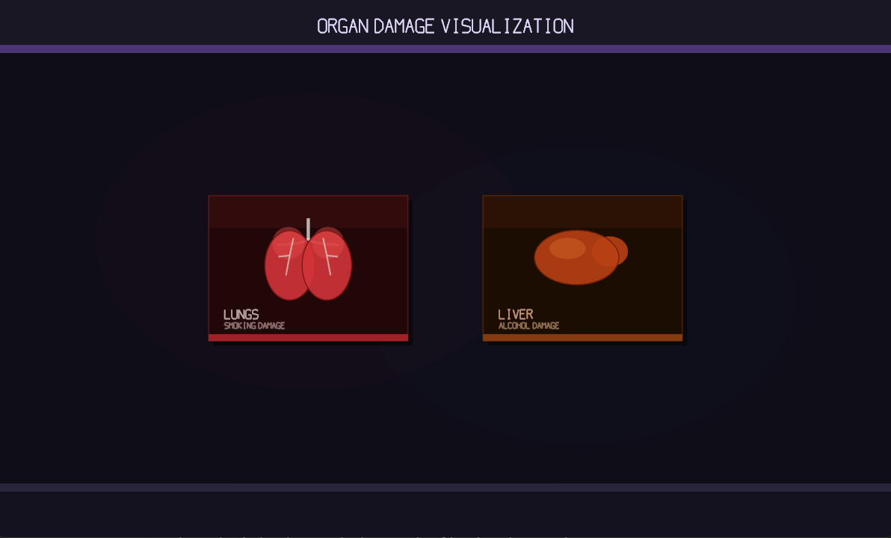
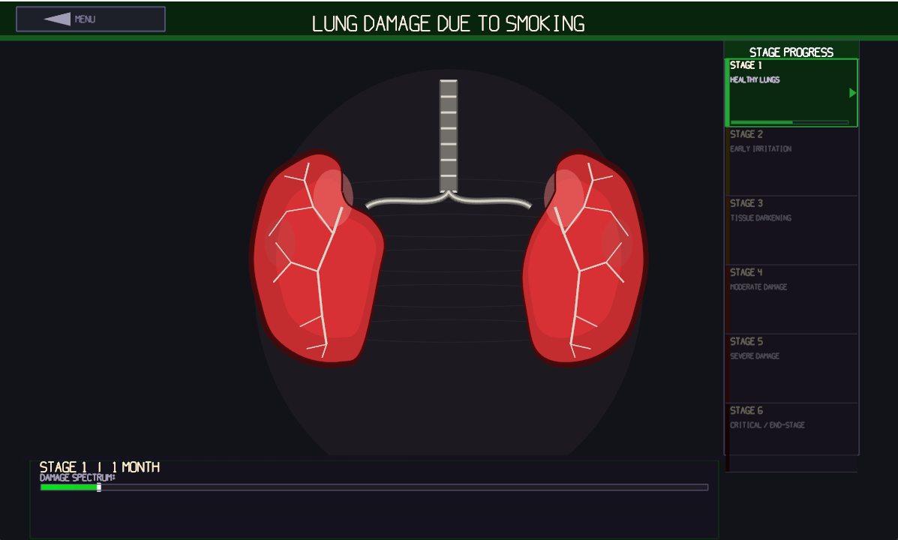
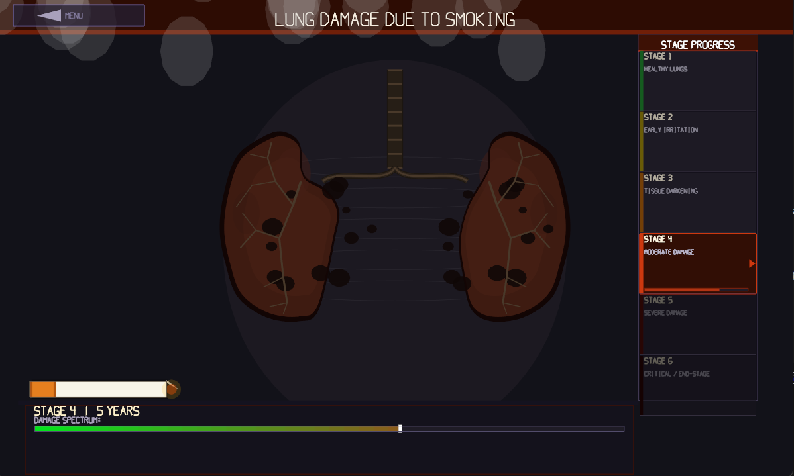
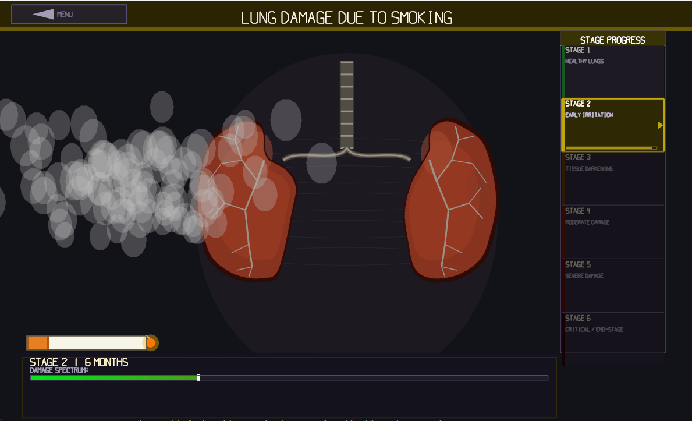
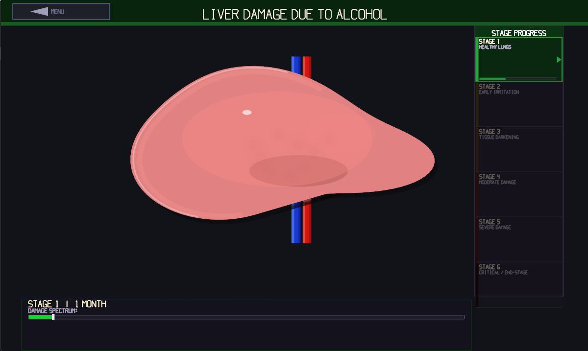
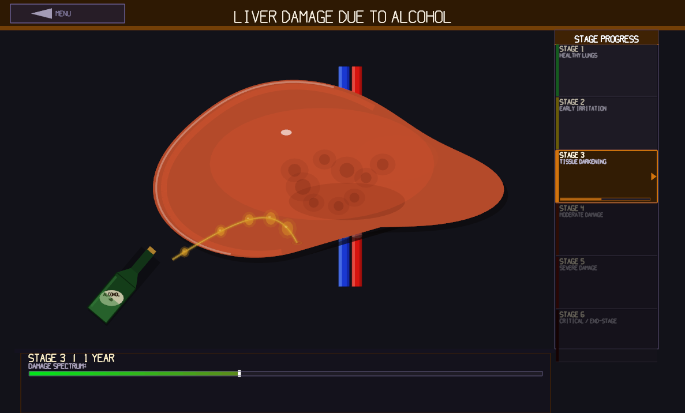
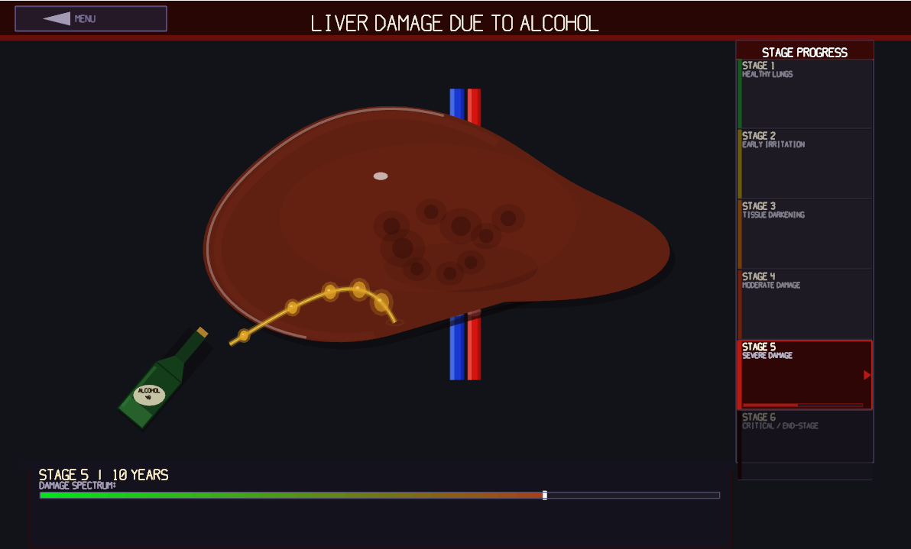

# Organ Damage Visualization
### Tribhuvan University — ENCT 201 | Computer Graphics Semester Project

A real-time interactive visualization of progressive organ damage using OpenGL (GLFW + GLAD) in C++. The project demonstrates core computer graphics algorithms through anatomically-styled 2D organ simulations with stage-by-stage damage progression.

---

## Screenshots


| Main Menu | Lungs — Stage 1 | Lungs — Stage 6 |
|-----------|----------------|----------------|
|  |  |  | 

| Liver — Stage 1 | Liver — Stage 3 | Liver — Stage 6 |
|----------------|----------------|----------------|
|  |  |  |

---

## Organs

### Lungs — Smoking Damage
Visualizes progressive lung damage caused by long-term smoking across 6 stages from healthy tissue to critical end-stage disease. Features animated cigarette smoke particles, bronchial tree rendering, and breathing animation.

### Liver — Alcohol Damage
Visualizes progressive liver damage caused by chronic alcohol consumption across 6 stages from healthy to cirrhosis. Features a tilted bottle pouring alcohol onto the liver surface, IVC and hepatic artery vessels, and damage spot accumulation.

---

## Damage Stages

| Stage | Lungs | Liver |
|-------|-------|-------|
| 1 | Healthy Lungs — 1 Month | Fatty Deposits — 1 Month |
| 2 | Early Irritation — 1 Year | Steatosis — 1 Year |
| 3 | Tissue Darkening — 5 Years | Hepatitis — 5 Years |
| 4 | Moderate Damage — 10 Years | Fibrosis — 10 Years |
| 5 | Severe Damage — 20 Years | Cirrhosis — 20 Years |
| 6 | Critical / End-Stage — 30 Years | End-Stage — 30 Years |

---

## Algorithms Demonstrated

| Chapter | Algorithm | Used In |
|---------|-----------|---------|
| Ch. 2 | `GL_POLYGON` scan-line fill | Organ body fill |
| Ch. 2 | Circle rasterisation | Damage spots, nodes |
| Ch. 3 | 2D Translation & Rotation | Bottle tilt, canvas placement |
| Ch. 4 | Quadratic Bezier curves | Hepatic veins, bronchi |
| Ch. 4 | Cubic Bezier curves | Alcohol pour stream |
| Ch. 4 | Catmull-Rom spline | Lung outline shape |
| Ch. 4 | Polar parametric curve | Liver outline shape |
| Ch. 6 | Gouraud shading | Organ dome highlights, vessel edges |
| Ch. 7 | Key-frame animation | Stage progression |
| Ch. 7 | Direct-motion (sinusoidal) | Breathing / pulse animation |

---

## Project Structure

```
organ-visualization/
│
├── include/              ← GLAD, GLFW headers
├── lib/
│   └── libglfw3dll.a
│
└── src/
    ├── glad.c
    ├── renderer.h/.cpp   ← GL drawing utilities, Col3, R_* helpers
    ├── animation.h/.cpp  ← Stage data, AnimState, breathing
    ├── particles.h/.cpp  ← Particle system (smoke / vapor)
    ├── geometry.h/.cpp   ← Bezier, Catmull-Rom curves
    ├── lighting.h/.cpp   ← Gouraud shading helpers
    ├── text.h            ← Bitmap text rendering
    ├── lungs.h/.cpp      ← Lung simulation (smoking damage)
    ├── liver.h/.cpp      ← Liver simulation (alcohol damage)
    ├── main.cpp          ← Window, event loop, menu/dashboard
    └── glfw3.dll
```

---

## Controls

| Key | Action |
|-----|--------|
| `TAB` | Switch between Liver and Lungs |
| `→` / `Right Arrow` | Advance to next damage stage |
| `←` / `Left Arrow` | Go back to previous stage |
| `A` | Toggle auto-progression |
| `R` | Restart simulation |
| `ESC` | Return to menu / Quit |

---

## Build Instructions

### Requirements
- Windows (MinGW / VS Code)
- OpenGL 2.1+
- GLFW 3.x
- GLAD

### Build (VS Code)
Open any `.cpp` file in `src/` and press `Ctrl+Shift+B`.

The `tasks.json` compiles all source files:
```
g++ -std=c++17 src/glad.c src/renderer.cpp src/geometry.cpp
    src/animation.cpp src/lighting.cpp src/particles.cpp
    src/lungs.cpp src/liver.cpp src/main.cpp
    -Iinclude -Llib -lglfw3dll -lopengl32 -lgdi32
    -o src/organ_viz.exe
```

### Run
```
cd src
organ_viz.exe
```
> `glfw3.dll` must be in the `src/` folder for the executable to run.

---

## Technical Notes

**Why GLFW and not GLUT?**
The project originally had a GLUT prototype for the liver. GLUT and GLFW cannot coexist in the same executable as they both manage the window and event loop. Everything was ported to GLFW — only the window management changed, all `gl*` drawing calls are identical since they are raw OpenGL, not GLUT-specific.

**Organ animation**
Both organs breathe using `anim.breathScale()` — a sinusoidal oscillation around `1.0` applied to the contour scale each frame, driven by `anim.totalTime` which advances via `anim.update(dt)` in the main loop.

**Vessel translucency (Liver)**
The IVC (blue) and hepatic artery (red) are drawn before the liver body. The liver fill is fully opaque so it covers the vessels in the middle. Shine caps (`GL_TRIANGLE_FAN` half-ellipses) are drawn at the entry and exit points to give the appearance of tubes passing through the organ.

---

## Authors

| Name | Roll No | Module |
|------|---------|--------|
| Sanskriti Adhikari | 081BCT075 | Liver Simulation |
| Tejaswi Acharya | 081BCT088 | Lungs Simulation |

**Tribhuvan University — Institute of Engineering**
Bachelor of Computer Engineering — Computer Graphics
